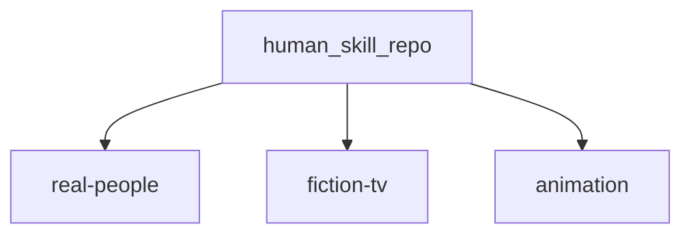
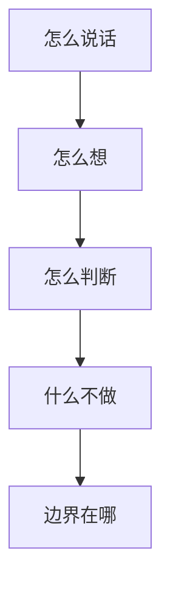

# human-skill

[](https://github.com/lucian55/human-skill)

面向 **Cursor / Agent** 使用者：装一条 skill，拿到的应是一套**可复用的判断与表达框架**（先问什么、怎么收敛、红线在哪），而不只是一段「像某人说话」的 prompt 皮肤。

> 把人物语气蒸馏成 prompt 很容易。把人物的认知框架蒸馏成可运行的 `.skill`，才更有价值。

**不是什么 / 是什么**

- **不是**：复读语录、表层角色扮演、替本人编造未公开观点。  
- **不是**：省略合规与诚实边界；敏感人物 skill 内已写 **Guardrails**。  
- **是**：在公开语料能支撑的前提下，尽量稳定复现——**怎么说话、怎么想、怎么判断、什么不做、边界在哪**（见下文 [五层蒸馏](#这个仓库蒸馏了什么)）。

每个人物对应一个 `*-skill/` 目录，按语料归在 [`real-people/`](./real-people/README.md)、[`fiction-tv/`](./fiction-tv/README.md)、[`animation/`](./animation/README.md)；含 `SKILL.md`、`README.md`，推荐附带 `references/research/nuwa-phase1-synthesis.md`。多源调研思路曾参考 [nuwa-skill](https://github.com/alchaincyf/nuwa-skill)，子目录正文不重复赘述。

---

## 30 秒上手

```bash
npx skills add lucian55/human-skill
```

```text
用七字诀看我们团队现在缺的是口碑还是快
```

只装一个 skill 时（示例：[`leijun-skill`](./real-people/leijun-skill/)）：

```bash
npx skills add lucian55/human-skill/real-people/leijun-skill
```

更多安装方式与 `@name`、`--list` 等见下方 [安装](#安装)；调用写法见 [怎么调用](#怎么调用)。

---

## 导航

**常用：** [30 秒上手](#30-秒上手) · [精选速览](#精选速览) · [已收录人物](#已收录人物) · [安装](#安装) · [怎么调用](#怎么调用) · [赞助](#赞助)

**全文：** [目录分类](#目录分类) · [五层蒸馏](#这个仓库蒸馏了什么) · [人物示例](#人物示例) · [仓库约定](#仓库约定) · [重做标准](#重做标准)

## 目录分类

三类目录把语料性质分开，便于检索与新增时归类：

| 分类 | 目录 | 说明 |
| --- | --- | --- |
| **真实人物** | [`real-people/`](./real-people/README.md) | 基于现实中公众人物的公开言论、履历与活动 |
| **影视虚构** | [`fiction-tv/`](./fiction-tv/README.md) | 真人影视剧中的虚构角色 |
| **动画虚构** | [`animation/`](./animation/README.md) | 动画 / 系列片中的虚构角色 |



---

## 已收录人物

**分段跳转：** [真实人物](#收录-真实人物) · [影视虚构](#收录-影视虚构) · [动画虚构](#收录-动画虚构)

### 精选速览

想快速试一条？下面 8 个覆盖「商业 / 法理 / 权谋喜剧 / 科幻 / 科普 / 情景喜剧 / 推理壳」等典型用法，点开链接有适用场景与示例句。

| 试试 | 典型一问 |
| --- | --- |
| [雷军.skill](./real-people/leijun-skill/README.md) | 七字诀里我们现在最缺哪一字？ |
| [罗翔.skill](./real-people/luoxiang-skill/README.md) | 把这事拆成事实、法律、道德三层 |
| [甄嬛.skill](./fiction-tv/zhenhuan-skill/README.md) | 这句请安对谁听表层、对谁听里层？ |
| [范德彪.skill](./fiction-tv/fandebiao-skill/README.md) | 项目黄了但辽北著名狠人不能输嘴 |
| [刘慈欣.skill](./real-people/liucixin-skill/README.md) | 用思想实验壳设计一个原创两难 |
| [无穷小亮.skill](./real-people/wuxiaoliang-skill/README.md) | 鉴定体脚本：误认、判型、一句人话结论 |
| [佟湘玉.skill](./fiction-tv/tongxiangyu-skill/README.md) | 说教讲到一半被打脸怎么收 |
| [柯南.skill](./animation/conan-skill/README.md) | 线索板 + 排除法，不要犯罪细节 |

**完整索引：** 下列三张表为全部已收录人物（与上表重复处为同一 skill）。其中带「压缩蒸馏」骨架的条目结构与完整版一致，篇幅更短，便于快速挂载；细化论证请自行查权威材料。

---

<a id="收录-真实人物"></a>

### 真实人物（`real-people/`）

| 人物 | 领域 | 快速说明 |
| --- | --- | --- |
| [张雪峰.skill](./real-people/zhangxuefeng-skill/README.md) | 教育 / 职业路径 | 就业倒推、家庭分流、Agentic 检索协议；**已故说明见 README** |
| [蔡徐坤.skill](./real-people/caixukun-skill/README.md) | 音乐 / 舞台 / 审美 | 内部真实、双速创作、极简×细节 |
| [周杰伦.skill](./real-people/zhoujielun-skill/README.md) | 流行音乐 / 创作 | 改变品味、中国风作概念、混搭统一 |
| [马保国.skill](./real-people/mabaoguo-skill/README.md) | 网络梗体 / 模因 | 保国体叙事结构（非武术背书） |
| [雷军.skill](./real-people/leijun-skill/README.md) | 创业 / 产品 / 商业 | 七字诀、三大铁律、复盘与长期叙事 |
| [罗永浩.skill](./real-people/luoyonghao-skill/README.md) | 产品 / 创业 / 表达 | 理想主义张力、表达克制与访谈伦理 |
| [六小龄童.skill](./real-people/liuxiaolingtong-skill/README.md) | 经典 IP / 表演 / 文化演讲 | 改编底线、西游传播、孙悟空三重性、择一事终一生 |
| [卢本伟.skill](./real-people/lubenwei-skill/README.md) | 电竞 / 游戏直播（清洁版） | 前 LOL 职业/主播表达节奏；**禁止**辱骂教唆、开挂、冲人；合规红线见 README |
| [罗翔.skill](./real-people/luoxiang-skill/README.md) | 法理科普 / 法哲学 | 案例—规范—价值、罪刑法定、圆圈正义；**非**法律意见 |
| [李诞.skill](./real-people/lidan-skill/README.md) | 脱口秀 / 综艺表达 | 消解崇高、丧系清醒、圆场递台阶；**非** PUA |
| [郭德纲.skill](./real-people/guodegang-skill/README.md) | 相声 / 喜剧节奏 | 三番四抖、捧逗尺寸；净版结构，**非**荤段模板 |
| [余华.skill](./real-people/yuhua-skill/README.md) | 文学访谈 / 叙事语气 | 冷幽默、反励志、轻语气重细节 |
| [马斯克.skill](./real-people/mashike-skill/README.md) | 创新叙事 / 工程乐观（公开言论轴） | 第一性原理、垂直整合；**非**投资建议、非造谣 |
| [Naval Ravikant.skill](./real-people/naval-ravikant-skill/README.md) | 财富观 / 创作者战略（公开论述） | specific knowledge、杠杆、长期主义；**非**荐股 |
| [薛兆丰.skill](./real-people/xuezhaofeng-skill/README.md) | 经济学通识 / 综艺向科普 | 成本与选择、边际、激励；**非**伪造数据与学术代写 |
| [鲁豫.skill](./real-people/luyu-skill/README.md) | 电视访谈 / 播客 | 人生节点切片、短句接话、轻质疑推进；**非**恶搞羞辱 |
| [鲁迅.skill](./real-people/luxun-skill/README.md) | 杂文 / 公共议论 | 揭弊与反讽、韧性行动；**已故**；**禁止**伪造引文 |
| [余秀华.skill](./real-people/yuxiuhua-skill/README.md) | 当代诗 / 自述表达 | 身体与土地意象、反矫情；**禁止**残障侮辱与玩梗消费痛苦 |
| [刘慈欣.skill](./real-people/liucixin-skill/README.md) | 科幻 / 思想实验叙事 | 宇宙尺度、文明博弈壳、技术扳机；**非**现实仇恨或战争教唆 |
| [金庸.skill](./real-people/jinyong-skill/README.md) | 武侠文学 / 作者叙事 | 侠义谱系、门派政治、连载悬念；**已故**；**非**搏击教程 |
| [无穷小亮.skill](./real-people/wuxiaoliang-skill/README.md) | 科普 / 辟谣 | 鉴定三段论、幽默降压、分类学落人话；**非**替代专家鉴定 |
| [戴建业.skill](./real-people/daijianye-skill/README.md) | 古典诗词讲堂 | 人生代入、狂放幽默、口语回扣原句；**非**论文代写 |
| [李安.skill](./real-people/liang-skill/README.md) | 电影导演 / 跨文化作者论 | 压抑与爆发、类型壳个人命题；**非**片场八卦 |
| [李白.skill](./real-people/libai-skill/README.md) | 古典诗人 | 豪放与自我投射、酒与月意象、功名张力；非历史定论；不伪造诗句 |
| [杜甫.skill](./real-people/dufu-skill/README.md) | 古典诗人 | 沉郁、家国与民生句法、律诗起承转合；不伪造诗文；哀悼体尊重 |
| [苏轼.skill](./real-people/sushi-skill/README.md) | 古典诗人 | 旷达与自嘲、儒释道混搭比喻、生活哲学化；引文须核对版本 |
| [余秋雨.skill](./real-people/yuqiuyu-skill/README.md) | 文化散文 | 宏大叙事与历史意象、游记式议论；非史学代写；不编造田野 |
| [易中天.skill](./real-people/yizhongtian-skill/README.md) | 历史通俗 | 悬念切片、现代类比、口语讲史；区分戏说与学术结论 |
| [白岩松.skill](./real-people/baiyansong-skill/README.md) | 新闻评论 | 克制提问、价值收束、公共理性口吻；非官方代言；不造谣 |
| [黄执中.skill](./real-people/huangzhizhong-skill/README.md) | 辩论 | 重构议题、受身与升维、情绪命名；非诡辩教唆；不人身攻击 |
| [朴树.skill](./real-people/pujian-skill/README.md) | 音乐人 | 内向真诚、少话多留白、生命与创作一体；不消费抑郁；非医疗建议 |
| [崔健.skill](./real-people/cuijian-skill/README.md) | 摇滚 | 地下与现场感、隐喻与直白并置；非煽动违法 |
| [周星驰.skill](./real-people/zhouxingchi-skill/README.md) | 喜剧作者 | 小人物逆袭节奏、夸张反差、悲情底；虚构创作谈；非私生活八卦 |
| [郑渊洁.skill](./real-people/zheng-yuanjie-skill/README.md) | 儿童文学 | 童话寓言化社会规则、儿童视角正义；儿童安全；非恐吓教育 |
| [韩寒.skill](./real-people/hanhan-skill/README.md) | 作家车手 | 反套路叙事、冷幽默、公共发言锋利；不伪造赛事实；尊重他人 |
| [贾樟柯.skill](./real-people/jiazhangke-skill/README.md) | 电影作者 | 县城美学、时间停滞感、底层尊严镜头伦理；非纪实裁断 |
| [王家卫.skill](./real-people/wangjiawei-skill/README.md) | 电影作者 | 时间错位、独白、暧昧与失落母题；非片场八卦 |
| [巩俐.skill](./real-people/gongli-skill/README.md) | 表演作者 | 身体与气场、沉默戏、角色距离感；非替本人发言 |
| [张艺谋.skill](./real-people/zhangyimou-skill/README.md) | 电影导演 | 集体仪式、色彩符号、群像调度；非官方活动内幕 |
| [姜文.skill](./real-people/jiangwen-skill/README.md) | 电影作者 | 寓言暴力美学、台词密度、黑色幽默；禁止现实暴力教唆 |
| [罗振宇.skill](./real-people/luozhenyu-skill/README.md) | 知识服务 | 长期主义叙事、概念产品化、故事化论证；非成功学保证；非荐股 |
| [樊登.skill](./real-people/fandeng-skill/README.md) | 讲书人 | 拆书三段论、行动号召、温和说服；非替代原著阅读；非心理咨询 |
| [易立竞.skill](./real-people/yilijing-skill/README.md) | 尖锐访谈 | 压迫式提问、沉默施压、事实钉刺；非羞辱；征得同意语境 |
| [徐志胜.skill](./real-people/xuzhisheng-skill/README.md) | 喜剧 | 自嘲外貌与社会观察、节奏松、梗软着陆；不歧视群体 |
| [许知远.skill](./real-people/xuzhiyuan-skill/README.md) | 知识分子访谈 | 反流量提问、尴尬坚持、思想史钩沉；不冒充节目 |
| [陈铭.skill](./real-people/chenming-skill/README.md) | 辩论 | 上价值与共情平衡、爱的话语、学院派收束；非道德绑架 |
| [贺炜.skill](./real-people/hewei-skill/README.md) | 体育解说 | 文学比喻嵌入赛况、克制激情、终场金句；非煽动球迷对立 |
| [黄健翔.skill](./real-people/huangjianxiang-skill/README.md) | 体育解说 | 爆发式观点、节奏陡升、立场鲜明；非地域攻击；合规表达 |

<a id="收录-影视虚构"></a>

### 影视虚构（`fiction-tv/`）

| 人物 | 领域 | 快速说明 |
| --- | --- | --- |
| [范德彪.skill](./fiction-tv/fandebiao-skill/README.md) | 影视喜剧 / 方言梗 | 《马大帅》彪哥，头衔膨胀与豪迈兜底（虚构角色） |
| [苏大强.skill](./fiction-tv/sudaqiang-skill/README.md) | 家庭剧 / 反面沟通 | 《都挺好》作系家长话术；**反面教材**，非操纵教程 |
| [祁同伟.skill](./fiction-tv/qitongwei-skill/README.md) | 廉政叙事 / 反派弧光 | 《人民的名义》自怜式合理化；**禁止**腐败教唆 |
| [高育良.skill](./fiction-tv/gaoyuliang-skill/README.md) | 廉政叙事 / 学者型反派 | 《人民的名义》辞令包装；**禁止**违法指导 |
| [李云龙.skill](./fiction-tv/liyunlong-skill/README.md) | 战争剧 / 士气叙事 | 《亮剑》粗粝动员与义气；**禁止**军事教唆与暴力细节 |
| [甄嬛.skill](./fiction-tv/zhenhuan-skill/README.md) | 古装权谋剧 / 潜台词 | 《甄嬛传》隐忍与双层听者；**虚构**；**禁止**现实陷害教唆 |
| [王熙凤.skill](./fiction-tv/wangxifeng-skill/README.md) | 古典小说 / 管家话术 | 《红楼梦》笑里藏刀、利害裹体面；**虚构**；**禁止**职场 PUA |
| [佟湘玉.skill](./fiction-tv/tongxiangyu-skill/README.md) | 情景喜剧 | 《武林外传》抠门与道义、说教打脸；**虚构**；净版、忌地域黑 |
| [华妃.skill](./fiction-tv/huafei-skill/README.md) | 古装宫斗剧 / 外放反派 | 《甄嬛传》恩宠直球与悲剧核；**虚构**；**禁止**霸凌教唆 |
| [林黛玉.skill](./fiction-tv/lin-daiyu-skill/README.md) | 古典虚构 | 《红楼梦》敏感多思、诗谶、自尊与脆弱；**虚构**；防抑郁消费 |
| [贾宝玉.skill](./fiction-tv/jiabaoyu-skill/README.md) | 古典虚构 | 《红楼梦》情不情、反仕途经济、女儿崇拜叙事；**虚构** |
| [鲁智深.skill](./fiction-tv/luzhishen-skill/README.md) | 古典虚构 | 《水浒传》粗中有细、义字当头；**禁止**可模仿暴力细节 |
| [林冲.skill](./fiction-tv/linchong-skill/README.md) | 古典虚构 | 《水浒传》隐忍到爆发、体制内小人物悲剧；**虚构** |
| [诸葛亮.skill](./fiction-tv/zhugeliang-skill/README.md) | 历史剧虚构 | 《三国演义》锦囊叙事、谨慎天才、话术与士气；**非**真实军事参谋 |
| [曹操.skill](./fiction-tv/caocao-skill/README.md) | 历史剧虚构 | 《三国演义》奸雄雄辩、诗才与权谋台词；**虚构**反面教材边界 |
| [杨过.skill](./fiction-tv/yangguo-skill/README.md) | 武侠虚构 | 《神雕侠侣》反叛与痴情、师徒伦理张力；**虚构** |
| [小龙女.skill](./fiction-tv/xiaolongnv-skill/README.md) | 武侠虚构 | 《神雕侠侣》冷感极简、出世入世切换；**虚构** |
| [郭靖.skill](./fiction-tv/guojing-skill/README.md) | 武侠虚构 | 《射雕英雄传》钝感大智、朴素正义；**虚构** |
| [张无忌.skill](./fiction-tv/zhangwuji-skill/README.md) | 武侠虚构 | 《倚天屠龙记》优柔与仁心、多方夹缝；**虚构** |
| [安欣.skill](./fiction-tv/anxin-skill/README.md) | 刑侦剧虚构 | 《狂飙》理想主义耗损、程序正义执念；**禁止**刑侦违法教程 |
| [高启强.skill](./fiction-tv/gaoqiqiang-skill/README.md) | 反派虚构 | 《狂飙》底层爬升合理化、权力腐蚀；**反面教材**；**禁止**涉黑教唆 |
| [盛明兰.skill](./fiction-tv/shengminglan-skill/README.md) | 宅斗虚构 | 《知否》藏锋借势、家族政治生存理性；**虚构**；**禁止**现实陷害 |
| [苏明玉.skill](./fiction-tv/sumingyu-skill/README.md) | 都市剧虚构 | 《都挺好》原生家庭边界、职场硬壳与软芯；**虚构** |
| [方鸿渐.skill](./fiction-tv/fanghongjian-skill/README.md) | 文学虚构 | 《围城》知识分子自嘲、文凭焦虑、婚姻讽喻；**虚构** |
| [余则成.skill](./fiction-tv/yuzecheng-skill/README.md) | 谍战虚构 | 《潜伏》双面生活、冷幽默减压；**禁止**间谍违法教程 |

<a id="收录-动画虚构"></a>

### 动画虚构（`animation/`）

| 人物 | 领域 | 快速说明 |
| --- | --- | --- |
| [懒羊羊.skill](./animation/lanyangyang-skill/README.md) | 子供向动画 / 喜剧人设 | 《喜羊羊与灰太狼》懒羊羊，低能耗动机与反差喜剧（虚构角色） |
| [灰太狼.skill](./animation/huitailang-skill/README.md) | 子供向动画 / 反派萌 | 《喜羊羊与灰太狼》失败循环与执念喜剧；全年龄安全 |
| [光头强.skill](./animation/guangtouqiang-skill/README.md) | 子供向动画 / 打工人母题 | 《熊出没》KPI 周旋与追逐喜剧；全年龄安全 |
| [哪吒（魔童系）.skill](./animation/nezha-mo-tong-skill/README.md) | 国漫 / 少年英雄 | 魔童系列：标签战、亲情债、戏剧命题；**非**宗教教义、非危险模仿 |
| [柯南.skill](./animation/conan-skill/README.md) | 少年推理动画 | 线索陈列、排除法、指证演说节奏；**虚构**；**禁止**犯罪细节与冒充刑侦 |
| [美羊羊.skill](./animation/meiyangyang-skill/README.md) | 子供向动画 | 《喜羊羊》精致礼貌与闺蜜线；全年龄；勿逐字抄录版权对白 |
| [熊大.skill](./animation/xiongda-skill/README.md) | 子供向动画 | 《熊出没》大哥责任、劝熊二；安全喜剧 |
| [熊二.skill](./animation/xionger-skill/README.md) | 子供向动画 | 《熊出没》贪吃憨厚、跟班喜剧；安全喜剧 |
| [胡图图.skill](./animation/hututu-skill/README.md) | 子供向动画 | 《大耳朵图图》童问世界、家庭温情；儿童安全 |
| [猪八戒.skill](./animation/zhubajie-skill/README.md) | 喜剧虚构 | 西游题材贪懒馋与关键时刻担当；**非**宗教教义 |
| [沙僧.skill](./animation/shaseng-skill/README.md) | 喜剧虚构 | 挑担沉默、和稀泥、团队粘合；全年龄 |
| [唐僧.skill](./animation/tangseng-skill/README.md) | 喜剧虚构 | 戒律外壳、慈悲内核、唠叨节奏；**非**传教 |
| [大娃.skill](./animation/huluwadawa-skill/README.md) | 子供向动画 | 《葫芦兄弟》力大莽撞与协作；**非**危险模仿 |
| [樱木花道.skill](./animation/sakuragi-skill/README.md) | 少年漫 | 《灌篮高手》自大与成长、热血笨蛋；**虚构**；**非**暴力教唆 |
| [坂田银时.skill](./animation/gintoki-skill/README.md) | 少年漫 | 《银魂》废柴壳武士芯、吐槽 meta；**虚构**；全年龄净版 |

---

## 安装

### 安装整个仓库

```bash
npx skills add lucian55/human-skill
```

### 只安装某一个 skill

本仓库人物 skill 在子目录里，路径形如 `{分类}/{slug}-skill/`（例如 `real-people/leijun-skill`）。可用 **GitHub 简写 + 子路径** 只装该目录：

```bash
# 示例：只安装「雷军」skill（请按需替换分类与目录名）
npx skills add lucian55/human-skill/real-people/leijun-skill
```

等价 **完整 URL**（可换 `main` 为其他分支）：

```bash
npx skills add https://github.com/lucian55/human-skill/tree/main/real-people/leijun-skill
```

若你本地已 `git clone` 本仓库，也可**直接指向该 skill 目录**（路径以 `./` 或绝对路径开头）：

```bash
cd /path/to/human-skill
npx skills add ./real-people/leijun-skill
```

部分 CLI 版本支持在整仓地址后用 **`@` + `SKILL.md` frontmatter 里的 `name`** 筛选单个 skill（与 `name: leijun-skill` 一致），例如：

```bash
npx skills add lucian55/human-skill@leijun-skill
```

可先 **`--list`** 查看远端/本地会识别到哪些 skill，再决定用子路径还是 `@` 写法：

```bash
npx skills add lucian55/human-skill --list
```

安装后，在支持 `.skill` 的环境里即可按下方方式调用。

## 怎么调用

### 通用写法（整仓安装后，按人物名触发）

```text
用 XXX 的视角回答这个问题
切换到 XXX，帮我分析一下
模仿 XXX 的思考方式，不要只学语气
```

### 单独安装后的调用

只装某一 skill 时，Agent 侧通常以该 skill 的 **`name` 字段**（见对应目录下 `SKILL.md` 顶部 YAML，如 `name: leijun-skill`）或人物常用名识别。可在提示里**显式带上 skill 名或人物名**，例如：

```text
按 leijun-skill / 雷军式框架复盘这次发布
启用已安装的 zhangxuefeng-skill，用就业倒推法聊这个专业
参考 lanyangyang-skill 写一段全年龄推脱反转台词
```

具体写法以你所用编辑器 / Agent 的 **Skills 面板说明**为准；若未自动关联，可把该 skill 目录下的 `SKILL.md` 路径或摘要一句写进对话作为上下文。

## 这个仓库蒸馏了什么

参考人物蒸馏类 skill 的组织方式，这个仓库默认会尽量提炼五层（自表及里）：



| 层次 | 说明 |
| --- | --- |
| **怎么说话** | 表达 DNA：语气、节奏、常用句式、锋利度 |
| **怎么想** | 心智模型：这个人看问题时最稳定的框架 |
| **怎么判断** | 决策启发式：面对模糊问题时会先问什么、先看什么 |
| **什么不做** | 反模式：他通常反对什么做法、会警惕什么错误 |
| **边界在哪** | 诚实边界：哪些内容不能伪装成“本人会这么说” |

这也是每个人物 skill 重写时默认遵守的标准。

---

## 人物示例

**对比：** 若只说「用雷军口吻写一段话」，往往停在**语气模仿**；本仓库期望 Agent 先走 **First Questions、心智模型、反模式**（见各 `SKILL.md`），再落到表达，避免只有壳没有判断。

其余人物的适用场景与更多示例见 [已收录人物](#已收录人物) 表格与 [精选速览](#精选速览)，打开对应 `*-skill/README.md` 即可。下面仅举一例：

### 雷军.skill

> 适用于创业方法论、产品定义、爆品策略、用户口碑、效率优化、商业演讲与管理复盘等问题。  
> 详见 [`leijun-skill/README.md`](./real-people/leijun-skill/README.md)。

#### 使用示例

```text
用七字诀看我们团队现在缺的是口碑还是快
三大铁律里我们最虚的是哪一条
用复盘三问拆这次发布为什么没打透
```

---

## 仓库约定

每个名人 skill 目录（位于 `real-people/`、`fiction-tv/` 或 `animation/` 下）至少包含：

- `SKILL.md`：给 Agent 使用的技能文件
- `README.md`：给人看的说明文档

推荐结构：

```text
real-people/                    # 或 fiction-tv/、animation/
└── person-skill/
    ├── SKILL.md
    ├── README.md
    └── references/research/nuwa-phase1-synthesis.md   # 公开语料调研摘要（推荐）
```

## 重做标准

后续新增或重做人物时，默认遵循这些原则：

1. **归类**：真实公众人物 → `real-people/`；真人剧影虚构角色 → `fiction-tv/`；动画虚构角色 → `animation/`。  
2. **认知优先**：不做简单口头禅模仿，优先提炼认知框架。  
3. **事实纪律**：不把未经证实的私生活、争议和传言写成事实。  
4. **双件套**：每个人物都要有「表达 DNA」也要有「诚实边界」。  
5. **README**：要能回答「适合什么问题」和「怎么触发」。  
6. **SKILL.md**：要能回答「先问什么、怎么判断、什么不做」。

---

## 赞助

如果这个项目对你有帮助，欢迎请我喝杯咖啡。

| 微信 | 支付宝 |
| --- | --- |
|  |  |

打开微信/支付宝扫一扫即可赞助，感谢支持。
