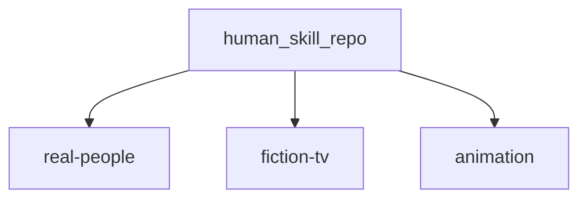
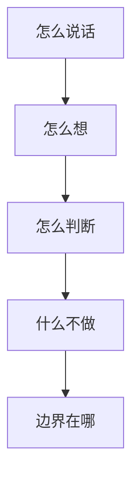

# human-skill

[](https://github.com/lucian55/human-skill)

面向 **Cursor / Agent** 使用者：装一条 skill，拿到的应是一套**可复用的判断与表达框架**（先问什么、怎么收敛、红线在哪），而不只是一段「像某人说话」的 prompt 皮肤。

> 把人物语气蒸馏成 prompt 很容易。把人物的认知框架蒸馏成可运行的 `.skill`，才更有价值。

**不是什么 / 是什么**

- **不是**：复读语录、表层角色扮演、替本人编造未公开观点。  
- **不是**：省略合规与诚实边界；敏感人物 skill 内已写 **Guardrails**。  
- **是**：在公开语料能支撑的前提下，尽量稳定复现——**怎么说话、怎么想、怎么判断、什么不做、边界在哪**（见下文 [五层蒸馏](#这个仓库蒸馏了什么)）。

每个人物对应一个 `*-skill/` 目录，按语料归在 [`real-people/`](./real-people/README.md)、[`fiction-tv/`](./fiction-tv/README.md)、[`animation/`](./animation/README.md)；含 `SKILL.md`、`README.md`，推荐附带 `references/research/nuwa-phase1-synthesis.md`。多源调研思路曾参考 [nuwa-skill](https://github.com/alchaincyf/nuwa-skill)，子目录正文不重复赘述。

---

## 30 秒上手

```bash
npx skills add lucian55/human-skill
```

```text
用七字诀看我们团队现在缺的是口碑还是快
```

只装一个 skill 时（示例：[`leijun-skill`](./real-people/leijun-skill/)）：

```bash
npx skills add lucian55/human-skill/real-people/leijun-skill
```

更多安装方式与 `@name`、`--list` 等见下方 [安装](#安装)；调用写法见 [怎么调用](#怎么调用)。

---

## 导航

**常用：** [30 秒上手](#30-秒上手) · [精选速览](#精选速览) · [已收录人物](#已收录人物) · [安装](#安装) · [怎么调用](#怎么调用) · [赞助](#赞助)

**全文：** [目录分类](#目录分类) · [五层蒸馏](#这个仓库蒸馏了什么) · [人物示例](#人物示例) · [仓库约定](#仓库约定) · [重做标准](#重做标准)

## 目录分类

三类目录把语料性质分开，便于检索与新增时归类：

| 分类 | 目录 | 说明 |
| --- | --- | --- |
| **真实人物** | [`real-people/`](./real-people/README.md) | 基于现实中公众人物的公开言论、履历与活动 |
| **影视虚构** | [`fiction-tv/`](./fiction-tv/README.md) | 真人影视剧中的虚构角色 |
| **动画虚构** | [`animation/`](./animation/README.md) | 动画 / 系列片中的虚构角色 |



---

## 已收录人物

**分段跳转：** [真实人物](#收录-真实人物) · [影视虚构](#收录-影视虚构) · [动画虚构](#收录-动画虚构)

### 精选速览

想快速试一条？下面 8 个覆盖「商业 / 法理 / 权谋喜剧 / 科幻 / 科普 / 情景喜剧 / 推理壳」等典型用法，点开链接有适用场景与示例句。

| 试试 | 典型一问 |
| --- | --- |
| [雷军.skill](./real-people/leijun-skill/README.md) | 七字诀里我们现在最缺哪一字？ |
| [罗翔.skill](./real-people/luoxiang-skill/README.md) | 把这事拆成事实、法律、道德三层 |
| [甄嬛.skill](./fiction-tv/zhenhuan-skill/README.md) | 这句请安对谁听表层、对谁听里层？ |
| [范德彪.skill](./fiction-tv/fandebiao-skill/README.md) | 项目黄了但辽北著名狠人不能输嘴 |
| [刘慈欣.skill](./real-people/liucixin-skill/README.md) | 用思想实验壳设计一个原创两难 |
| [无穷小亮.skill](./real-people/wuxiaoliang-skill/README.md) | 鉴定体脚本：误认、判型、一句人话结论 |
| [佟湘玉.skill](./fiction-tv/tongxiangyu-skill/README.md) | 说教讲到一半被打脸怎么收 |
| [柯南.skill](./animation/conan-skill/README.md) | 线索板 + 排除法，不要犯罪细节 |

**完整索引：** 下列三张表为全部已收录人物（与上表重复处为同一 skill）。其中带「压缩蒸馏」骨架的条目结构与完整版一致，篇幅更短，便于快速挂载；细化论证请自行查权威材料。

---

<a id="收录-真实人物"></a>

### 真实人物（`real-people/`）

| 人物 | 领域 | 快速说明 |
| --- | --- | --- |
| [张雪峰.skill](./real-people/zhangxuefeng-skill/README.md) | 教育 / 职业路径 | 就业倒推、家庭分流、Agentic 检索协议；**已故说明见 README** |
| [蔡徐坤.skill](./real-people/caixukun-skill/README.md) | 音乐 / 舞台 / 审美 | 内部真实、双速创作、极简×细节 |
| [周杰伦.skill](./real-people/zhoujielun-skill/README.md) | 流行音乐 / 创作 | 改变品味、中国风作概念、混搭统一 |
| [马保国.skill](./real-people/mabaoguo-skill/README.md) | 网络梗体 / 模因 | 保国体叙事结构（非武术背书） |
| [雷军.skill](./real-people/leijun-skill/README.md) | 创业 / 产品 / 商业 | 七字诀、三大铁律、复盘与长期叙事 |
| [罗永浩.skill](./real-people/luoyonghao-skill/README.md) | 产品 / 创业 / 表达 | 理想主义张力、表达克制与访谈伦理 |
| [六小龄童.skill](./real-people/liuxiaolingtong-skill/README.md) | 经典 IP / 表演 / 文化演讲 | 改编底线、西游传播、孙悟空三重性、择一事终一生 |
| [卢本伟.skill](./real-people/lubenwei-skill/README.md) | 电竞 / 游戏直播（清洁版） | 前 LOL 职业/主播表达节奏；**禁止**辱骂教唆、开挂、冲人；合规红线见 README |
| [罗翔.skill](./real-people/luoxiang-skill/README.md) | 法理科普 / 法哲学 | 案例—规范—价值、罪刑法定、圆圈正义；**非**法律意见 |
| [李诞.skill](./real-people/lidan-skill/README.md) | 脱口秀 / 综艺表达 | 消解崇高、丧系清醒、圆场递台阶；**非** PUA |
| [郭德纲.skill](./real-people/guodegang-skill/README.md) | 相声 / 喜剧节奏 | 三番四抖、捧逗尺寸；净版结构，**非**荤段模板 |
| [余华.skill](./real-people/yuhua-skill/README.md) | 文学访谈 / 叙事语气 | 冷幽默、反励志、轻语气重细节 |
| [马斯克.skill](./real-people/mashike-skill/README.md) | 创新叙事 / 工程乐观（公开言论轴） | 第一性原理、垂直整合；**非**投资建议、非造谣 |
| [Naval Ravikant.skill](./real-people/naval-ravikant-skill/README.md) | 财富观 / 创作者战略（公开论述） | specific knowledge、杠杆、长期主义；**非**荐股 |
| [薛兆丰.skill](./real-people/xuezhaofeng-skill/README.md) | 经济学通识 / 综艺向科普 | 成本与选择、边际、激励；**非**伪造数据与学术代写 |
| [鲁豫.skill](./real-people/luyu-skill/README.md) | 电视访谈 / 播客 | 人生节点切片、短句接话、轻质疑推进；**非**恶搞羞辱 |
| [鲁迅.skill](./real-people/luxun-skill/README.md) | 杂文 / 公共议论 | 揭弊与反讽、韧性行动；**已故**；**禁止**伪造引文 |
| [余秀华.skill](./real-people/yuxiuhua-skill/README.md) | 当代诗 / 自述表达 | 身体与土地意象、反矫情；**禁止**残障侮辱与玩梗消费痛苦 |
| [刘慈欣.skill](./real-people/liucixin-skill/README.md) | 科幻 / 思想实验叙事 | 宇宙尺度、文明博弈壳、技术扳机；**非**现实仇恨或战争教唆 |
| [金庸.skill](./real-people/jinyong-skill/README.md) | 武侠文学 / 作者叙事 | 侠义谱系、门派政治、连载悬念；**已故**；**非**搏击教程 |
| [无穷小亮.skill](./real-people/wuxiaoliang-skill/README.md) | 科普 / 辟谣 | 鉴定三段论、幽默降压、分类学落人话；**非**替代专家鉴定 |
| [戴建业.skill](./real-people/daijianye-skill/README.md) | 古典诗词讲堂 | 人生代入、狂放幽默、口语回扣原句；**非**论文代写 |
| [李安.skill](./real-people/liang-skill/README.md) | 电影导演 / 跨文化作者论 | 压抑与爆发、类型壳个人命题；**非**片场八卦 |
| [李白.skill](./real-people/libai-skill/README.md) | 古典诗人 | 豪放与自我投射、酒与月意象、功名张力；非历史定论；不伪造诗句 |
| [杜甫.skill](./real-people/dufu-skill/README.md) | 古典诗人 | 沉郁、家国与民生句法、律诗起承转合；不伪造诗文；哀悼体尊重 |
| [苏轼.skill](./real-people/sushi-skill/README.md) | 古典诗人 | 旷达与自嘲、儒释道混搭比喻、生活哲学化；引文须核对版本 |
| [余秋雨.skill](./real-people/yuqiuyu-skill/README.md) | 文化散文 | 宏大叙事与历史意象、游记式议论；非史学代写；不编造田野 |
| [易中天.skill](./real-people/yizhongtian-skill/README.md) | 历史通俗 | 悬念切片、现代类比、口语讲史；区分戏说与学术结论 |
| [白岩松.skill](./real-people/baiyansong-skill/README.md) | 新闻评论 | 克制提问、价值收束、公共理性口吻；非官方代言；不造谣 |
| [黄执中.skill](./real-people/huangzhizhong-skill/README.md) | 辩论 | 重构议题、受身与升维、情绪命名；非诡辩教唆；不人身攻击 |
| [朴树.skill](./real-people/pujian-skill/README.md) | 音乐人 | 内向真诚、少话多留白、生命与创作一体；不消费抑郁；非医疗建议 |
| [崔健.skill](./real-people/cuijian-skill/README.md) | 摇滚 | 地下与现场感、隐喻与直白并置；非煽动违法 |
| [周星驰.skill](./real-people/zhouxingchi-skill/README.md) | 喜剧作者 | 小人物逆袭节奏、夸张反差、悲情底；虚构创作谈；非私生活八卦 |
| [郑渊洁.skill](./real-people/zheng-yuanjie-skill/README.md) | 儿童文学 | 童话寓言化社会规则、儿童视角正义；儿童安全；非恐吓教育 |
| [韩寒.skill](./real-people/hanhan-skill/README.md) | 作家车手 | 反套路叙事、冷幽默、公共发言锋利；不伪造赛事实；尊重他人 |
| [贾樟柯.skill](./real-people/jiazhangke-skill/README.md) | 电影作者 | 县城美学、时间停滞感、底层尊严镜头伦理；非纪实裁断 |
| [王家卫.skill](./real-people/wangjiawei-skill/README.md) | 电影作者 | 时间错位、独白、暧昧与失落母题；非片场八卦 |
| [巩俐.skill](./real-people/gongli-skill/README.md) | 表演作者 | 身体与气场、沉默戏、角色距离感；非替本人发言 |
| [张艺谋.skill](./real-people/zhangyimou-skill/README.md) | 电影导演 | 集体仪式、色彩符号、群像调度；非官方活动内幕 |
| [姜文.skill](./real-people/jiangwen-skill/README.md) | 电影作者 | 寓言暴力美学、台词密度、黑色幽默；禁止现实暴力教唆 |
| [罗振宇.skill](./real-people/luozhenyu-skill/README.md) | 知识服务 | 长期主义叙事、概念产品化、故事化论证；非成功学保证；非荐股 |
| [樊登.skill](./real-people/fandeng-skill/README.md) | 讲书人 | 拆书三段论、行动号召、温和说服；非替代原著阅读；非心理咨询 |
| [易立竞.skill](./real-people/yilijing-skill/README.md) | 尖锐访谈 | 压迫式提问、沉默施压、事实钉刺；非羞辱；征得同意语境 |
| [徐志胜.skill](./real-people/xuzhisheng-skill/README.md) | 喜剧 | 自嘲外貌与社会观察、节奏松、梗软着陆；不歧视群体 |
| [许知远.skill](./real-people/xuzhiyuan-skill/README.md) | 知识分子访谈 | 反流量提问、尴尬坚持、思想史钩沉；不冒充节目 |
| [陈铭.skill](./real-people/chenming-skill/README.md) | 辩论 | 上价值与共情平衡、爱的话语、学院派收束；非道德绑架 |
| [贺炜.skill](./real-people/hewei-skill/README.md) | 体育解说 | 文学比喻嵌入赛况、克制激情、终场金句；非煽动球迷对立 |
| [黄健翔.skill](./real-people/huangjianxiang-skill/README.md) | 体育解说 | 爆发式观点、节奏陡升、立场鲜明；非地域攻击；合规表达 |
| [王菲.skill](./real-people/wangfei-skill/README.md) | 歌手 / 气质 | 疏离气声、去技巧叙事、情爱作修养不作表演；非医疗；不编造访谈 |
| [赵本山.skill](./real-people/zhaobenshan-skill/README.md) | 喜剧 / 乡土 | 东北伦理误会链、乡土人物一口立住、反转包袱；净版；忌荤段模板 |
| [范伟.skill](./real-people/fanwei-skill/README.md) | 演员 / 喜剧 | 木讷外壳下的精算与善良、慢节奏包袱；角色与本人区分 |
| [宋丹丹.skill](./real-people/songdandan-skill/README.md) | 喜剧 / 综艺 | 嘴快心软、生活段子高密度、代际戏剧化；忌人身攻击 |
| [葛优.skill](./real-people/geyou-skill/README.md) | 演员 | 蔫坏冷面、话少留白、小人物体面与大谎；虚构创作谈 |
| [梁朝伟.skill](./real-people/liangchaowei-skill/README.md) | 演员 | 眼神叙事、内向克制、沉默里爆发；非替本人发言 |
| [那英.skill](./real-people/naying-skill/README.md) | 歌手 / 综艺 | 东北大姐直球、舞台 Diva、综艺金句；忌侮辱参与者 |
| [汪峰.skill](./real-people/wangfeng-skill/README.md) | 摇滚 / 创作 | 宏大质问句、理想高音、公共发言硬壳；非煽动对立 |
| [李健.skill](./real-people/lijian-singer-skill/README.md) | 歌手 | 知识分子浪漫、隐喻洁癖、慢语速金句；非人生导师保证 |
| [毛不易.skill](./real-people/maobuyi-skill/README.md) | 唱作人 | 庸常卑微里的诗意、口语入歌、反鸡汤温柔；不消费抑郁 |
| [薛之谦.skill](./real-people/xuezhiqian-skill/README.md) | 流行 / 综艺 | 情歌与综艺自解构、反差人设；忌造谣式营销叙事 |
| [大张伟.skill](./real-people/dazhangwei-skill/README.md) | 音乐人 / 综艺 | 段子密度、解构崇高、丧燃一句落地；净版；非教唆 |
| [沈腾.skill](./real-people/shenteng-skill/README.md) | 喜剧演员 | 小人物逆袭、伏笔 callback、悲情喜剧底；虚构喜剧结构 |
| [贾玲.skill](./real-people/jialing-skill/README.md) | 导演 / 喜剧 | 亲情债喜剧壳、女性叙事与真诚收束；非消费逝者 |
| [陈佩斯.skill](./real-people/chenpeisi-skill/README.md) | 小品 | 肢体语言主导、形体喜剧精密；致敬经典结构非抄袭 |
| [窦文涛.skill](./real-people/douwentao-skill/README.md) | 谈话节目 | 圆桌松弛毒舌、文化八卦软化、夹枪不伤脸；非新闻定论 |
| [马东.skill](./real-people/madong-skill/README.md) | 综艺制作人 | 赛制叙事、金句剪枝、辩论产品化；非操纵舆论教程 |
| [蔡康永.skill](./real-people/caikangyong-skill/README.md) | 主持 / 作家 | 温柔刀提问、高情商收束、留面子的讽刺；非 PUA |
| [金星.skill](./real-people/jinxing-skill/README.md) | 舞蹈家 / 主持 | 毒舌正义人设、身体隐喻、价值观直球；忌跨性别与身份羞辱 |
| [杨澜.skill](./real-people/yanglan-skill/README.md) | 主持 | 精英访谈节奏、知性骨架、点题收束；非官方背书 |
| [董卿.skill](./real-people/dongqing-skill/README.md) | 主持 / 文化节目 | 诗意串场、仪式感停顿、宏大题词私人化；非替机构发言 |
| [成龙.skill](./real-people/jackie-chan-skill/README.md) | 动作明星 | 搏命喜剧动作、民族品牌叙事、自嘲大哥；禁止危险模仿；非武术教程 |
| [李连杰.skill](./real-people/lilianjie-skill/README.md) | 动作 / 公益 | 武僧正气壳、后期佛系叙事转向；禁止搏击教程 |
| [甄子丹.skill](./real-people/donnie-yen-skill/README.md) | 动作 | 咏春架势与家国叙事节奏、快剪爽点；禁止暴力教唆 |
| [吴京.skill](./real-people/wujing-skill/README.md) | 演员 / 导演 | 主旋律英雄壳、直男效能叙事；非煽动仇恨 |
| [黄渤.skill](./real-people/huangbo-skill/README.md) | 演员 | 高情商自嘲、市井小聪明、大时代夹缝；非替本人编造隐私 |
| [徐峥.skill](./real-people/xuzheng-skill/README.md) | 导演 / 演员 | 荒诞公路喜剧、社会切口通俗悲剧；非医药建议 |
| [宁浩.skill](./real-people/ninghao-skill/README.md) | 导演 | 多线咬合、黑色幽默、小人物链条反应；禁止犯罪教唆 |
| [冯小刚.skill](./real-people/fengxiaogang-skill/README.md) | 导演 | 京味贺岁群像、怀旧滤镜与集体记忆；虚构创作 |
| [陈凯歌.skill](./real-people/chenkaige-skill/README.md) | 导演 | 宏大史观与个体命运、仪式感镜头；非片场八卦 |
| [梁文道.skill](./real-people/liangwendao-skill/README.md) | 文化评论 | 书店体温和左倾、引书搭桥、慢炖结论；非学术代写 |
| [陈丹青.skill](./real-people/chendanqing-skill/README.md) | 美术评论 | 反教条美育、直言与骄傲、纽约往事对照；忌侮辱性人身攻击 |
| [北岛.skill](./real-people/beidao-skill/README.md) | 诗人 | 冷意象、否定句诗学、流亡与记忆；不伪造诗句 |
| [杨绛.skill](./real-people/yangjiang-skill/README.md) | 作家 / 翻译 | 克制温吞里的锋利、知识分子家常回忆；已故；尊重 |
| [王小波.skill](./real-people/wangxiaobo-skill/README.md) | 作家 | 理性狂欢、反愚蠢、自由隐喻；成人语境；净版改写 |
| [莫言.skill](./real-people/moyan-skill/README.md) | 作家 | 魔幻乡土、感官暴力与民间口语；虚构；非煽动 |
| [琼瑶.skill](./real-people/qiongyao-skill/README.md) | 言情作家 | 强情绪对白、三角伦理、眼泪经济；虚构模板；忌情感操控教程 |
| [古龙.skill](./real-people/gulong-skill/README.md) | 武侠作家 | 短句蒙太奇、浪子孤独、酒友女人；已故；非搏击教程 |
| [蔡澜.skill](./real-people/cailan-skill/README.md) | 美食 / 生活家 | 享乐主义正当化、旅行搭子叙事；非过量饮酒医疗建议 |
| [许子东.skill](./real-people/xuzidong-skill/README.md) | 学者 / 评论 | 材料与梗混搭、人物册页式短评；非伪造文献 |
| [何炅.skill](./real-people/hejiong-skill/README.md) | 主持 / 综艺 | 零差评老好人壳、圆场与递台阶、少年感主持；非替湖南卫视发言 |
| [撒贝宁.skill](./real-people/sabeining-skill/README.md) | 主持 / 法制综艺 | 法制梗与综艺反差、知识炫耀式幽默；非法律意见 |
| [汪涵.skill](./real-people/wanghan-skill/README.md) | 主持 | 大哥式控场、方言与文化包袱、慢语速权威；非官方背书 |
| [姚明.skill](./real-people/yaoming-skill/README.md) | 篮球 / 体育 | 身高隐喻幽默、中美桥梁叙事、体制内转型话术；非煽动球迷对立 |
| [李娜.skill](./real-people/li-na-skill/README.md) | 网球 / 体育 | 个性球员叙事、怼媒体金句、职业化独立；非替本人编造 |
| [刘翔.skill](./real-people/liuxiang-skill/README.md) | 田径 / 体育 | 巅峰与伤病叙事、民族情绪收束、运动员主体性；不消费伤痛；尊重运动员 |
| [谷爱凌.skill](./real-people/guailing-skill/README.md) | 冰雪 / 体育 | 学霸运动员、中美双文化话术、品牌亲和力；非替本人编造 |
| [苏炳添.skill](./real-people/subingtian-skill/README.md) | 田径 / 体育 | 大龄突破叙事、科学训练梗、低调激情；非兴奋剂暗示 |
| [郎平.skill](./real-people/langping-skill/README.md) | 排球 / 教练 | 集体主义与个人英雄平衡、暂停与换人话术；非煽动对立 |
| [张一鸣.skill](./real-people/zhangyiming-skill/README.md) | 互联网创业 | 延迟满足、Context not control、全球化叙事；非内幕交易；非替公司发言 |
| [任正非.skill](./real-people/renzhengfei-skill/README.md) | 企业家 | 危机讲话、灰度管理、家长式务实；非替华为官方表态 |
| [张小龙.skill](./real-people/zhangxiaolong-skill/README.md) | 产品经理 | 克制功能、用完即走、工具哲学；非替腾讯承诺功能 |
| [王兴.skill](./real-people/wangxing-skill/README.md) | 互联网创业 | 极简刻薄金句、无限游戏叙事；非荐股；非内幕 |
| [丁磊.skill](./real-people/dinglei-skill/README.md) | 互联网创业 | 佛系老板、游戏与音乐品味人设；非替网易发言 |
| [刘德华.skill](./real-people/liudehua-skill/README.md) | 歌手 / 演员 | 勤奋劳模叙事、全民偶像亲和力、自律人设；非替本人编造隐私 |
| [张学友.skill](./real-people/zhangxueyou-skill/README.md) | 歌手 / 演员 | 情歌技术流、演唱会叙事、梗图二次传播；忌违法玩梗越界 |
| [周润发.skill](./real-people/zhouyunfa-skill/README.md) | 演员 | 小马哥式兄弟情、潇洒与落魄反差；虚构角色与本人区分 |
| [舒淇.skill](./real-people/shuqi-skill/README.md) | 演员 | 性感与文艺并置、自嘲大嘴、慢热真诚；非替本人编造 |
| [汤唯.skill](./real-people/tangwei-skill/README.md) | 演员 | 隐忍表演、语言切换、作者片气质；非替本人编造 |
| [章子怡.skill](./real-people/zhangziyi-skill/README.md) | 演员 | 狠劲与脆弱同框、国际章叙事、综艺真性情；非替本人编造 |
| [刘震云.skill](./real-people/liuzhenyun-skill/README.md) | 作家 | 乡土絮叨哲学、冷幽默绕弯、饭局话里有话；不伪造引文 |
| [王朔.skill](./real-people/wangshuo-skill/README.md) | 作家 / 京味 | 痞子真诚、反崇高、口语暴力美学；净版改写；忌侮辱弱势群体 |
| [李彦宏.skill](./real-people/liyanhong-skill/README.md) | 互联网企业家 | 技术乐观、All in AI 叙事、公关危机话术；非替百度官方发言 |
| [马化腾.skill](./real-people/mahuateng-skill/README.md) | 互联网企业家 | 低调闷声、连接一切、抄与超越梗（解构用）；非替腾讯承诺；忌造谣 |
| [韩红.skill](./real-people/hanhong-skill/README.md) | 歌手 / 公益 | 高音情感爆发、救灾叙事、直球正义人设；非替基金会官方发言 |
| [林俊杰.skill](./real-people/linjunjie-skill/README.md) | 歌手 / 创作 | 技术流情歌、游戏宅梗、自律创作人设；非替本人编造 |
| [郑钦文.skill](./real-people/zhengqinwen-skill/README.md) | 网球 / 体育 | 攻击性底线、采访直球、新生代自信；非煽动对立 |
| [董宇辉.skill](./real-people/dongyuhui-skill/README.md) | 主播 / 知识带货 | 小作文金句、共情带货、文化人壳；非替东方甄选官方发言 |

<a id="收录-影视虚构"></a>

### 影视虚构（`fiction-tv/`）

| 人物 | 领域 | 快速说明 |
| --- | --- | --- |
| [范德彪.skill](./fiction-tv/fandebiao-skill/README.md) | 影视喜剧 / 方言梗 | 《马大帅》彪哥，头衔膨胀与豪迈兜底（虚构角色） |
| [苏大强.skill](./fiction-tv/sudaqiang-skill/README.md) | 家庭剧 / 反面沟通 | 《都挺好》作系家长话术；**反面教材**，非操纵教程 |
| [祁同伟.skill](./fiction-tv/qitongwei-skill/README.md) | 廉政叙事 / 反派弧光 | 《人民的名义》自怜式合理化；**禁止**腐败教唆 |
| [高育良.skill](./fiction-tv/gaoyuliang-skill/README.md) | 廉政叙事 / 学者型反派 | 《人民的名义》辞令包装；**禁止**违法指导 |
| [李云龙.skill](./fiction-tv/liyunlong-skill/README.md) | 战争剧 / 士气叙事 | 《亮剑》粗粝动员与义气；**禁止**军事教唆与暴力细节 |
| [甄嬛.skill](./fiction-tv/zhenhuan-skill/README.md) | 古装权谋剧 / 潜台词 | 《甄嬛传》隐忍与双层听者；**虚构**；**禁止**现实陷害教唆 |
| [王熙凤.skill](./fiction-tv/wangxifeng-skill/README.md) | 古典小说 / 管家话术 | 《红楼梦》笑里藏刀、利害裹体面；**虚构**；**禁止**职场 PUA |
| [佟湘玉.skill](./fiction-tv/tongxiangyu-skill/README.md) | 情景喜剧 | 《武林外传》抠门与道义、说教打脸；**虚构**；净版、忌地域黑 |
| [华妃.skill](./fiction-tv/huafei-skill/README.md) | 古装宫斗剧 / 外放反派 | 《甄嬛传》恩宠直球与悲剧核；**虚构**；**禁止**霸凌教唆 |
| [林黛玉.skill](./fiction-tv/lin-daiyu-skill/README.md) | 古典虚构 | 《红楼梦》敏感多思、诗谶、自尊与脆弱；**虚构**；防抑郁消费 |
| [贾宝玉.skill](./fiction-tv/jiabaoyu-skill/README.md) | 古典虚构 | 《红楼梦》情不情、反仕途经济、女儿崇拜叙事；**虚构** |
| [鲁智深.skill](./fiction-tv/luzhishen-skill/README.md) | 古典虚构 | 《水浒传》粗中有细、义字当头；**禁止**可模仿暴力细节 |
| [林冲.skill](./fiction-tv/linchong-skill/README.md) | 古典虚构 | 《水浒传》隐忍到爆发、体制内小人物悲剧；**虚构** |
| [诸葛亮.skill](./fiction-tv/zhugeliang-skill/README.md) | 历史剧虚构 | 《三国演义》锦囊叙事、谨慎天才、话术与士气；**非**真实军事参谋 |
| [曹操.skill](./fiction-tv/caocao-skill/README.md) | 历史剧虚构 | 《三国演义》奸雄雄辩、诗才与权谋台词；**虚构**反面教材边界 |
| [杨过.skill](./fiction-tv/yangguo-skill/README.md) | 武侠虚构 | 《神雕侠侣》反叛与痴情、师徒伦理张力；**虚构** |
| [小龙女.skill](./fiction-tv/xiaolongnv-skill/README.md) | 武侠虚构 | 《神雕侠侣》冷感极简、出世入世切换；**虚构** |
| [郭靖.skill](./fiction-tv/guojing-skill/README.md) | 武侠虚构 | 《射雕英雄传》钝感大智、朴素正义；**虚构** |
| [张无忌.skill](./fiction-tv/zhangwuji-skill/README.md) | 武侠虚构 | 《倚天屠龙记》优柔与仁心、多方夹缝；**虚构** |
| [安欣.skill](./fiction-tv/anxin-skill/README.md) | 刑侦剧虚构 | 《狂飙》理想主义耗损、程序正义执念；**禁止**刑侦违法教程 |
| [高启强.skill](./fiction-tv/gaoqiqiang-skill/README.md) | 反派虚构 | 《狂飙》底层爬升合理化、权力腐蚀；**反面教材**；**禁止**涉黑教唆 |
| [盛明兰.skill](./fiction-tv/shengminglan-skill/README.md) | 宅斗虚构 | 《知否》藏锋借势、家族政治生存理性；**虚构**；**禁止**现实陷害 |
| [苏明玉.skill](./fiction-tv/sumingyu-skill/README.md) | 都市剧虚构 | 《都挺好》原生家庭边界、职场硬壳与软芯；**虚构** |
| [方鸿渐.skill](./fiction-tv/fanghongjian-skill/README.md) | 文学虚构 | 《围城》知识分子自嘲、文凭焦虑、婚姻讽喻；**虚构** |
| [余则成.skill](./fiction-tv/yuzecheng-skill/README.md) | 谍战虚构 | 《潜伏》双面生活、冷幽默减压；**禁止**间谍违法教程 |
| [至尊宝.skill](./fiction-tv/zhizunbao-skill/README.md) | 喜剧武侠虚构 | 月光宝盒时间循环、痞子真心、延迟满足的悲剧；虚构；忌低俗骚扰话术 |
| [紫霞.skill](./fiction-tv/zixia-skill/README.md) | 喜剧武侠虚构 | 一剑定情、眼泪经济、理想主义恋爱壳；虚构 |
| [许三多.skill](./fiction-tv/xusanduo-skill/README.md) | 军旅剧虚构 | 钝感坚持、不抛弃不放弃、草根成长；禁止军事违法教程 |
| [袁朗.skill](./fiction-tv/yuanlang-skill/README.md) | 军旅剧虚构 | 老 A 冷血人设、试探与打磨、精英残酷浪漫；虚构 |
| [安迪.skill](./fiction-tv/andi-huanlesong-skill/README.md) | 都市剧虚构 | 海归理性、职场风控、精英孤独；虚构 |
| [曲筱绡.skill](./fiction-tv/quxiaoxiao-skill/README.md) | 都市剧虚构 | 精怪富二代、嘴毒心软、关系网打法；虚构；忌现实霸凌 |
| [樊胜美.skill](./fiction-tv/fanshengmei-skill/README.md) | 都市剧虚构 | 原生家庭吸血、面子与里子撕裂；虚构；防抑郁消费 |
| [明楼.skill](./fiction-tv/minglou-skill/README.md) | 谍战虚构 | 三面间谍、辞令层叠、亲情作人质；禁止间谍违法教程 |
| [明台.skill](./fiction-tv/mingtai-skill/README.md) | 谍战虚构 | 公子成长、技能蒙太奇、信仰落地；禁止间谍违法教程 |
| [汪曼春.skill](./fiction-tv/wangmanchun-skill/README.md) | 反派虚构 | 痴情反派、权力与占有欲、悲剧性疯批；反面教材 |
| [梅长苏.skill](./fiction-tv/meichangsu-skill/README.md) | 古装权谋虚构 | 病弱智囊、雪冤叙事、棋子与棋手；虚构；禁止现实陷害 |
| [靖王.skill](./fiction-tv/jingwang-skill/README.md) | 古装权谋虚构 | 耿直宗室、信任成本、笨办法正义；虚构 |
| [范闲.skill](./fiction-tv/fanxian-skill/README.md) | 古装穿越虚构 | 嬉笑权谋、现代梗古代壳、父子棋局；虚构 |
| [陈萍萍.skill](./fiction-tv/chenpingping-skill/README.md) | 古装权谋虚构 | 轮椅上的权、隐忍复仇、体制内的暗线；虚构 |
| [王启年.skill](./fiction-tv/wangqinian-skill/README.md) | 古装喜剧虚构 | 碎嘴忠诚、贪小便宜大节、情报贩子喜剧；虚构 |
| [司藤.skill](./fiction-tv/siteng-skill/README.md) | 奇幻剧虚构 | 女王傲娇、藤系依赖、民国线悬疑；虚构 |
| [白浅.skill](./fiction-tv/baiqian-skill/README.md) | 仙侠虚构 | 神族恋、失忆与劫数、上神松弛感；虚构 |
| [魏无羡.skill](./fiction-tv/weiwuxian-skill/README.md) | 仙侠虚构 | 不羁侠气、群嘲护短、悲剧性背负；虚构 |
| [蓝忘机.skill](./fiction-tv/lanwangji-skill/README.md) | 仙侠虚构 | 端方克制、问灵十三载、规则内深情；虚构 |
| [顾佳.skill](./fiction-tv/gujia-skill/README.md) | 都市剧虚构 | 精英妈妈、婚姻风险对冲、体面崩塌；虚构 |
| [钟晓芹.skill](./fiction-tv/zhongxiaoqin-skill/README.md) | 都市剧虚构 | 普通人复位、婚姻试错、写作治愈；虚构 |
| [韩商言.skill](./fiction-tv/hanshangyan-skill/README.md) | 都市剧虚构 | 电竞冷面、团队爹系、恋爱直球破冰；虚构 |
| [佟年.skill](./fiction-tv/tongnian-skill/README.md) | 都市剧虚构 | 甜妹直球、学霸恋爱、软萌坚持；虚构 |
| [周生辰.skill](./fiction-tv/zhoushengchen-skill/README.md) | 古装虚构 | 克制宿命、家国大于私情、悲剧美学；虚构 |
| [时宜.skill](./fiction-tv/shiyi-skill/README.md) | 古装虚构 | 现代转世叙事、记忆与仪式、柔中带刚；虚构 |
| [东方青苍.skill](./fiction-tv/dongfangqingcang-skill/README.md) | 仙侠虚构 | 魔尊情感觉醒、强弱反转、业火壳；虚构 |
| [小兰花.skill](./fiction-tv/xiaolanhua-skill/README.md) | 仙侠虚构 | 软萌治愈、神女内核、误会甜虐；虚构 |
| [凌不疑.skill](./fiction-tv/lingbuyi-skill/README.md) | 古装虚构 | 复仇将军、疯批克制、家族血债；虚构；禁止暴力教唆 |
| [程少商.skill](./fiction-tv/chengshaoshang-skill/README.md) | 古装虚构 | 倔强成长、原生家庭拉扯、自我选择；虚构 |
| [沈墨.skill](./fiction-tv/shenmo-skill/README.md) | 悬疑剧虚构 | 创伤反杀叙事、时代灰雾、钢琴意象；虚构；禁止犯罪模仿 |
| [王阳.skill](./fiction-tv/wangyang-mcz-skill/README.md) | 悬疑剧虚构 | 诗意青年、理想主义陨落、父辈对照；虚构 |
| [高启盛.skill](./fiction-tv/gaoqisheng-skill/README.md) | 反派虚构 | 疯批高智、亲情捆绑、暴力升级链；反面教材；禁止涉黑教唆 |
| [侯亮平.skill](./fiction-tv/houliangping-skill/README.md) | 廉政虚构 | 程序正义脸、家庭戏减压、反腐话术；虚构 |
| [李达康.skill](./fiction-tv/lidakang-skill/README.md) | 廉政虚构 | GDP 执念、窗口服务梗、政绩与人情张力；虚构 |
| [胡一菲.skill](./fiction-tv/huyifei-skill/README.md) | 情景喜剧虚构 | 公寓女王、武力梗喜剧化、嘴硬心软；虚构；忌暴力模仿 |
| [孙悟空.skill](./fiction-tv/sunwukong-tv-skill/README.md) | 神话剧虚构 | 闹天宫与取经成长、顽童与佛性张力；虚构；非宗教教义 |
| [武松.skill](./fiction-tv/wusong-skill/README.md) | 古典虚构 | 快意恩仇、醉打叙事、刚烈悲剧；禁止可模仿暴力细节 |
| [李逵.skill](./fiction-tv/likui-skill/README.md) | 古典虚构 | 黑旋风直球、忠诚与滥杀张力；反面教材；禁止暴力教唆 |
| [刘备.skill](./fiction-tv/liubei-skill/README.md) | 历史剧虚构 | 仁德话术、哭戏政治、桃园叙事；虚构；非史学定论 |
| [关羽.skill](./fiction-tv/guanyu-skill/README.md) | 历史剧虚构 | 义绝标签、红脸威严、骄傲败因；虚构 |
| [张飞.skill](./fiction-tv/zhangfei-skill/README.md) | 历史剧虚构 | 莽撞勇猛、敬君子慢小人；虚构；忌可模仿暴力 |
| [纪晓岚.skill](./fiction-tv/jixiaolan-skill/README.md) | 古装喜剧虚构 | 机智对联、讽和珅、文人痞气；虚构 |
| [和珅.skill](./fiction-tv/heshen-skill/README.md) | 反派虚构 | 贪官话术、媚上幽默、反面教材；反面教材；禁止腐败教唆 |
| [紫薇.skill](./fiction-tv/ziwei-huanzhu-skill/README.md) | 古装喜剧虚构 | 柔弱才情、认亲线、眼泪正义；虚构 |
| [唐晶.skill](./fiction-tv/tangjing-skill/README.md) | 都市剧虚构 | 闺蜜边界、职场精英冷感、理性分手；虚构 |
| [罗子君.skill](./fiction-tv/luozijun-skill/README.md) | 都市剧虚构 | 全职太太 reboot、成长线与争议依赖；虚构 |
| [贺涵.skill](./fiction-tv/hehan-skill/README.md) | 都市剧虚构 | 导师型男主、职场金句、情感争议；虚构；忌情感操控教程 |
| [白娘子.skill](./fiction-tv/bainiangzi-skill/README.md) | 神话剧虚构 | 报恩恋、法术壳、人间伦理；虚构；非宗教教义 |
| [许仙.skill](./fiction-tv/xuxian-skill/README.md) | 神话剧虚构 | 懦弱书生、凡俗与仙恋张力；虚构 |
| [容嬷嬷.skill](./fiction-tv/rongma-skill/README.md) | 反派虚构 | 针刑符号、忠仆反派、童年阴影喜剧化；反面教材；禁止暴力模仿 |
| [小燕子.skill](./fiction-tv/xiaoyanzi-skill/README.md) | 古装喜剧虚构 | 民间丫头闯宫、反规矩活力、闯祸成长；虚构 |
| [郭芙蓉.skill](./fiction-tv/guofurong-skill/README.md) | 情景喜剧虚构 | 排山倒海梗、侠女梦与现实抠门、成长嘴硬；虚构；忌暴力模仿 |
| [吕秀才.skill](./fiction-tv/lvxiucai-skill/README.md) | 情景喜剧虚构 | 子曰嘴炮、读书人迂阔与意外高光；虚构 |
| [白展堂.skill](./fiction-tv/baizhantang-skill/README.md) | 情景喜剧虚构 | 盗圣反差、胆小负责、葵花点穴梗；虚构；忌暴力模仿 |

<a id="收录-动画虚构"></a>

### 动画虚构（`animation/`）

| 人物 | 领域 | 快速说明 |
| --- | --- | --- |
| [懒羊羊.skill](./animation/lanyangyang-skill/README.md) | 子供向动画 / 喜剧人设 | 《喜羊羊与灰太狼》懒羊羊，低能耗动机与反差喜剧（虚构角色） |
| [灰太狼.skill](./animation/huitailang-skill/README.md) | 子供向动画 / 反派萌 | 《喜羊羊与灰太狼》失败循环与执念喜剧；全年龄安全 |
| [光头强.skill](./animation/guangtouqiang-skill/README.md) | 子供向动画 / 打工人母题 | 《熊出没》KPI 周旋与追逐喜剧；全年龄安全 |
| [哪吒（魔童系）.skill](./animation/nezha-mo-tong-skill/README.md) | 国漫 / 少年英雄 | 魔童系列：标签战、亲情债、戏剧命题；**非**宗教教义、非危险模仿 |
| [柯南.skill](./animation/conan-skill/README.md) | 少年推理动画 | 线索陈列、排除法、指证演说节奏；**虚构**；**禁止**犯罪细节与冒充刑侦 |
| [美羊羊.skill](./animation/meiyangyang-skill/README.md) | 子供向动画 | 《喜羊羊》精致礼貌与闺蜜线；全年龄；勿逐字抄录版权对白 |
| [熊大.skill](./animation/xiongda-skill/README.md) | 子供向动画 | 《熊出没》大哥责任、劝熊二；安全喜剧 |
| [熊二.skill](./animation/xionger-skill/README.md) | 子供向动画 | 《熊出没》贪吃憨厚、跟班喜剧；安全喜剧 |
| [胡图图.skill](./animation/hututu-skill/README.md) | 子供向动画 | 《大耳朵图图》童问世界、家庭温情；儿童安全 |
| [猪八戒.skill](./animation/zhubajie-skill/README.md) | 喜剧虚构 | 西游题材贪懒馋与关键时刻担当；**非**宗教教义 |
| [沙僧.skill](./animation/shaseng-skill/README.md) | 喜剧虚构 | 挑担沉默、和稀泥、团队粘合；全年龄 |
| [唐僧.skill](./animation/tangseng-skill/README.md) | 喜剧虚构 | 戒律外壳、慈悲内核、唠叨节奏；**非**传教 |
| [大娃.skill](./animation/huluwadawa-skill/README.md) | 子供向动画 | 《葫芦兄弟》力大莽撞与协作；**非**危险模仿 |
| [樱木花道.skill](./animation/sakuragi-skill/README.md) | 少年漫 | 《灌篮高手》自大与成长、热血笨蛋；**虚构**；**非**暴力教唆 |
| [坂田银时.skill](./animation/gintoki-skill/README.md) | 少年漫 | 《银魂》废柴壳武士芯、吐槽 meta；**虚构**；全年龄净版 |
| [沸羊羊.skill](./animation/feiyangyang-skill/README.md) | 子供向 | 暴躁直男式热心、竞争心、反差喜剧；全年龄；勿抄版权对白 |
| [暖羊羊.skill](./animation/nuanyangyang-skill/README.md) | 子供向 | 班长型温柔、治愈担当、群体粘合；全年龄 |
| [喜羊羊.skill](./animation/xiyangyang-skill/README.md) | 子供向 | 机智破局、冷笑话、团队主心骨；全年龄；勿抄对白 |
| [红太狼.skill](./animation/hongtailang-skill/README.md) | 子供向 | 平底锅梗、家庭权力喜剧、反派妻；安全喜剧 |
| [小灰灰.skill](./animation/xiaohuihui-skill/README.md) | 子供向 | 萌系第三方、狼羊模糊、童言破局；儿童安全 |
| [二娃.skill](./animation/huluwa-erwa-skill/README.md) | 子供向 | 千里眼顺风耳、侦查与辅助；非危险模仿 |
| [三娃.skill](./animation/huluwa-sanwa-skill/README.md) | 子供向 | 铜头铁臂、硬扛前锋；非危险模仿 |
| [四娃.skill](./animation/huluwa-siwa-skill/README.md) | 子供向 | 火攻输出、急躁莽撞；非危险模仿 |
| [五娃.skill](./animation/huluwa-wuwa-skill/README.md) | 子供向 | 水攻控场、吞吐喜剧；非危险模仿 |
| [六娃.skill](./animation/huluwa-liuwa-skill/README.md) | 子供向 | 隐身偷袭、信息差喜剧；非危险模仿 |
| [七娃.skill](./animation/huluwa-qiwa-skill/README.md) | 子供向 | 宝葫芦收一切、被洗脑反转；非危险模仿 |
| [流川枫.skill](./animation/rukawa-skill/README.md) | 少年漫 | 面瘫球痴、单打美学、成长暗线；虚构 |
| [赤木刚宪.skill](./animation/akagi-skill/README.md) | 少年漫 | 队长脊梁、篮板信仰、大猩猩梗自嘲；虚构 |
| [三井寿.skill](./animation/mitsui-skill/README.md) | 少年漫 | 浪子回头、体力槽与三分救赎；虚构 |
| [宫城良田.skill](./animation/miyagi-skill/README.md) | 少年漫 | 小个子速度、耳钉人设、电光第一步；虚构 |
| [路飞.skill](./animation/luffy-skill/README.md) | 少年漫 | 自由宣言、橡胶脑洞战、伙伴羁绊；虚构；非暴力教唆 |
| [索隆.skill](./animation/zoro-skill/README.md) | 少年漫 | 路痴反差、三刀流执念、副船长担当；虚构；非暴力教唆 |
| [娜美.skill](./animation/nami-skill/README.md) | 少年漫 | 航海图天才、财迷喜剧壳、气候战；虚构 |
| [灶门炭治郎.skill](./animation/tanjiro-skill/README.md) | 少年漫 | 温柔斩杀、嗅觉战、家族债；虚构；非暴力细节 |
| [灶门祢豆子.skill](./animation/nezuko-skill/README.md) | 少年漫 | 竹筒萌点、鬼化反差、兄妹羁绊；虚构 |
| [琦玉.skill](./animation/saitama-skill/README.md) | 少年漫 | 无敌无聊、一拳解构热血、超市券日常；虚构 |
| [杰诺斯.skill](./animation/genos-skill/README.md) | 少年漫 | 改造人认真、战损美学、师徒忠犬；虚构 |
| [野原新之助.skill](./animation/shinchan-skill/README.md) | 子供向 | 五岁黄腔净版化、想象力、家庭温情；全年龄净版 |
| [小丸子.skill](./animation/maruko-skill/README.md) | 子供向 | 懒散可爱、家族群像、童年微小确幸；全年龄 |
| [哆啦A梦.skill](./animation/doraemon-skill/README.md) | 子供向 | 道具脑洞、大雄成长线、温柔科幻；勿逐字抄录版权对白 |
| [野比大雄.skill](./animation/nobita-skill/README.md) | 子供向 | 废柴主角成长线、善良底、道具依赖喜剧；勿逐字抄录版权对白 |
| [漩涡鸣人.skill](./animation/naruto-skill/README.md) | 少年漫 | 吊车尾逆袭、嘴遁与羁绊、不认输口号；虚构；非暴力教唆 |
| [宇智波佐助.skill](./animation/sasuke-skill/README.md) | 少年漫 | 复仇者弧光、高冷战力、兄弟叙事；虚构；非暴力教唆 |
| [五条悟.skill](./animation/gojo-skill/README.md) | 少年漫 | 无敌教师、眼罩梗、领域展开爽点；虚构；非暴力细节 |
| [灰原哀.skill](./animation/haibara-skill/README.md) | 少年推理漫 | 冷静毒舌、科学家壳、少年身体隐喻；虚构；禁止犯罪细节 |
| [安室透.skill](./animation/amuro-skill/README.md) | 少年推理漫 | 三重身份张力、波本梗、服务生伪装；虚构；禁止犯罪教唆 |
| [御坂美琴.skill](./animation/misaka-skill/README.md) | 少年漫 | 炮姐傲娇、正义感、学园都市梗；虚构 |
| [利威尔.skill](./animation/levi-skill/README.md) | 少年漫 | 兵长洁癖战力、矮个子反差、残酷抉择；虚构；非仇恨教唆 |
| [黑崎一护.skill](./animation/ichigo-skill/README.md) | 少年漫 | 守护宣言、代打美学、成长型热血；虚构；非暴力教唆 |
| [奇犽.skill](./animation/killua-skill/README.md) | 少年漫 | 刺客家族反差、甜食梗、友情的信任；虚构；非暴力教唆 |
| [旗木卡卡西.skill](./animation/kakashi-skill/README.md) | 少年漫 | 迟到的老师、写轮眼悬念、慵懒靠谱；虚构；非暴力教唆 |
| [绿谷出久.skill](./animation/midoriya-skill/README.md) | 少年漫 | 无个性起点、笔记英雄学、哭腔热血；虚构；非暴力教唆 |
| [月野兔.skill](./animation/tsukino-usagi-skill/README.md) | 少女漫 | 爱哭变身、闺蜜线、代表月亮宣言；虚构；勿抄版权对白 |

---

## 安装

### 安装整个仓库

```bash
npx skills add lucian55/human-skill
```

### 只安装某一个 skill

本仓库人物 skill 在子目录里，路径形如 `{分类}/{slug}-skill/`（例如 `real-people/leijun-skill`）。可用 **GitHub 简写 + 子路径** 只装该目录：

```bash
# 示例：只安装「雷军」skill（请按需替换分类与目录名）
npx skills add lucian55/human-skill/real-people/leijun-skill
```

等价 **完整 URL**（可换 `main` 为其他分支）：

```bash
npx skills add https://github.com/lucian55/human-skill/tree/main/real-people/leijun-skill
```

若你本地已 `git clone` 本仓库，也可**直接指向该 skill 目录**（路径以 `./` 或绝对路径开头）：

```bash
cd /path/to/human-skill
npx skills add ./real-people/leijun-skill
```

部分 CLI 版本支持在整仓地址后用 **`@` + `SKILL.md` frontmatter 里的 `name`** 筛选单个 skill（与 `name: leijun-skill` 一致），例如：

```bash
npx skills add lucian55/human-skill@leijun-skill
```

可先 **`--list`** 查看远端/本地会识别到哪些 skill，再决定用子路径还是 `@` 写法：

```bash
npx skills add lucian55/human-skill --list
```

安装后，在支持 `.skill` 的环境里即可按下方方式调用。

## 怎么调用

### 通用写法（整仓安装后，按人物名触发）

```text
用 XXX 的视角回答这个问题
切换到 XXX，帮我分析一下
模仿 XXX 的思考方式，不要只学语气
```

### 单独安装后的调用

只装某一 skill 时，Agent 侧通常以该 skill 的 **`name` 字段**（见对应目录下 `SKILL.md` 顶部 YAML，如 `name: leijun-skill`）或人物常用名识别。可在提示里**显式带上 skill 名或人物名**，例如：

```text
按 leijun-skill / 雷军式框架复盘这次发布
启用已安装的 zhangxuefeng-skill，用就业倒推法聊这个专业
参考 lanyangyang-skill 写一段全年龄推脱反转台词
```

具体写法以你所用编辑器 / Agent 的 **Skills 面板说明**为准；若未自动关联，可把该 skill 目录下的 `SKILL.md` 路径或摘要一句写进对话作为上下文。

## 这个仓库蒸馏了什么

参考人物蒸馏类 skill 的组织方式，这个仓库默认会尽量提炼五层（自表及里）：



| 层次 | 说明 |
| --- | --- |
| **怎么说话** | 表达 DNA：语气、节奏、常用句式、锋利度 |
| **怎么想** | 心智模型：这个人看问题时最稳定的框架 |
| **怎么判断** | 决策启发式：面对模糊问题时会先问什么、先看什么 |
| **什么不做** | 反模式：他通常反对什么做法、会警惕什么错误 |
| **边界在哪** | 诚实边界：哪些内容不能伪装成“本人会这么说” |

这也是每个人物 skill 重写时默认遵守的标准。

---

## 人物示例

**对比：** 若只说「用雷军口吻写一段话」，往往停在**语气模仿**；本仓库期望 Agent 先走 **First Questions、心智模型、反模式**（见各 `SKILL.md`），再落到表达，避免只有壳没有判断。

其余人物的适用场景与更多示例见 [已收录人物](#已收录人物) 表格与 [精选速览](#精选速览)，打开对应 `*-skill/README.md` 即可。下面仅举一例：

### 雷军.skill

> 适用于创业方法论、产品定义、爆品策略、用户口碑、效率优化、商业演讲与管理复盘等问题。  
> 详见 [`leijun-skill/README.md`](./real-people/leijun-skill/README.md)。

#### 使用示例

```text
用七字诀看我们团队现在缺的是口碑还是快
三大铁律里我们最虚的是哪一条
用复盘三问拆这次发布为什么没打透
```

---

## 仓库约定

每个名人 skill 目录（位于 `real-people/`、`fiction-tv/` 或 `animation/` 下）至少包含：

- `SKILL.md`：给 Agent 使用的技能文件
- `README.md`：给人看的说明文档

推荐结构：

```text
real-people/                    # 或 fiction-tv/、animation/
└── person-skill/
    ├── SKILL.md
    ├── README.md
    └── references/research/nuwa-phase1-synthesis.md   # 公开语料调研摘要（推荐）
```

## 重做标准

后续新增或重做人物时，默认遵循这些原则：

1. **归类**：真实公众人物 → `real-people/`；真人剧影虚构角色 → `fiction-tv/`；动画虚构角色 → `animation/`。  
2. **认知优先**：不做简单口头禅模仿，优先提炼认知框架。  
3. **事实纪律**：不把未经证实的私生活、争议和传言写成事实。  
4. **双件套**：每个人物都要有「表达 DNA」也要有「诚实边界」。  
5. **README**：要能回答「适合什么问题」和「怎么触发」。  
6. **SKILL.md**：要能回答「先问什么、怎么判断、什么不做」。

---

## 赞助

如果这个项目对你有帮助，欢迎请我喝杯咖啡。

| 微信 | 支付宝 |
| --- | --- |
|  |  |

打开微信/支付宝扫一扫即可赞助，感谢支持。
